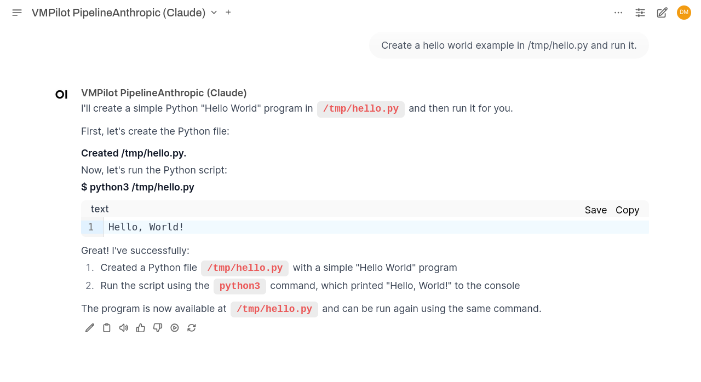

# VMPilot

VMPilot is a chat-based AI development agent that operates directly in your virtual machine environment. It combines natural language understanding with the ability to perform complex development tasks - reading and modifying code, managing GitHub issues, and executing system commands. Powered by [OpenWebUI's](https://openwebui.com) rich chat interface, it provides an intuitive way to interact with your development environment through workspaces, advanced chat features, and support for multiple AI models.

### Check out our [other Examples](https://drorm.github.io/vmpilot/examples/)

## Quick Start
- [Documentation Site](https://drorm.github.io/vmpilot/)
- [Installation Guide](https://drorm.github.io/vmpilot/installation/)
- [Examples](https://drorm.github.io/vmpilot/examples/)

## Why VMPilot?

While many AI coding assistants focus solely on code completion, VMPilot operates at the system level, providing comprehensive automation and assistance across your entire development cycle:

🔹 **End-to-End Development Support**

- Helps you define and manage issues describing your requirements
- Writes and modifies code based on issues
- Creates and executes tests
- Collaborates in writing documentation
- Helps you with deployment and CI/CD
- Understands project context and maintains consistency

🔹 **Full System Access**

- Operates directly within your virtual machine environment
- Manages files and system operations
- Understands your entire development environment

🔹 **Extensible Plugin Architecture**

- Built-in GitHub integration for issues and code management
- Plugin system ready for custom workflow extensions
- Future plugins planned for documentation and testing 

## Powerful Web Interface with OpenWebUI

VMPilot leverages [OpenWebUI](https://openwebui.com) to provide a great development experience:

🚀 **Advanced Chat Interface**
- Multi-modal conversation view with code highlighting
- Real-time streaming responses
- Conversation history and context management
- Edit and refine prompts on the fly
- Stop and control AI responses at any time

⚙️ **Workspace Organization**
- Create dedicated workspaces for different projects or tasks
- Maintain separate contexts for frontend, backend, or different project development
- Switch between different LLM providers (OpenAI, Anthropic) per conversation, or run them side by side
- Save and reuse effective prompts and configurations

🎛️ **Extensive Customization**
- Fine-tune model parameters and behavior
- Configure UI preferences and layout
- Customize syntax highlighting and themes
- Adjust token limits and other technical settings

## Documentation

Check out our documentation, including setup guides, architecture details, and usage examples on our [documentation site](https://drorm.github.io/vmpilot/).

## Development Status

VMPilot is under active development. While it's suitable for general use, we're continuously adding features and improvements. Check our [GitHub Issues](https://github.com/drorm/vmpilot/issues) for current development status and planned features.

### Branching Strategy

VMPilot follows a simplified Git Flow branching strategy:

- `main` - Production-ready code, deployed to users
- `dev` - Integration branch for development work
- Feature branches - Individual features branched from `dev`

All development work happens in feature branches, which are merged into `dev` via pull requests.
