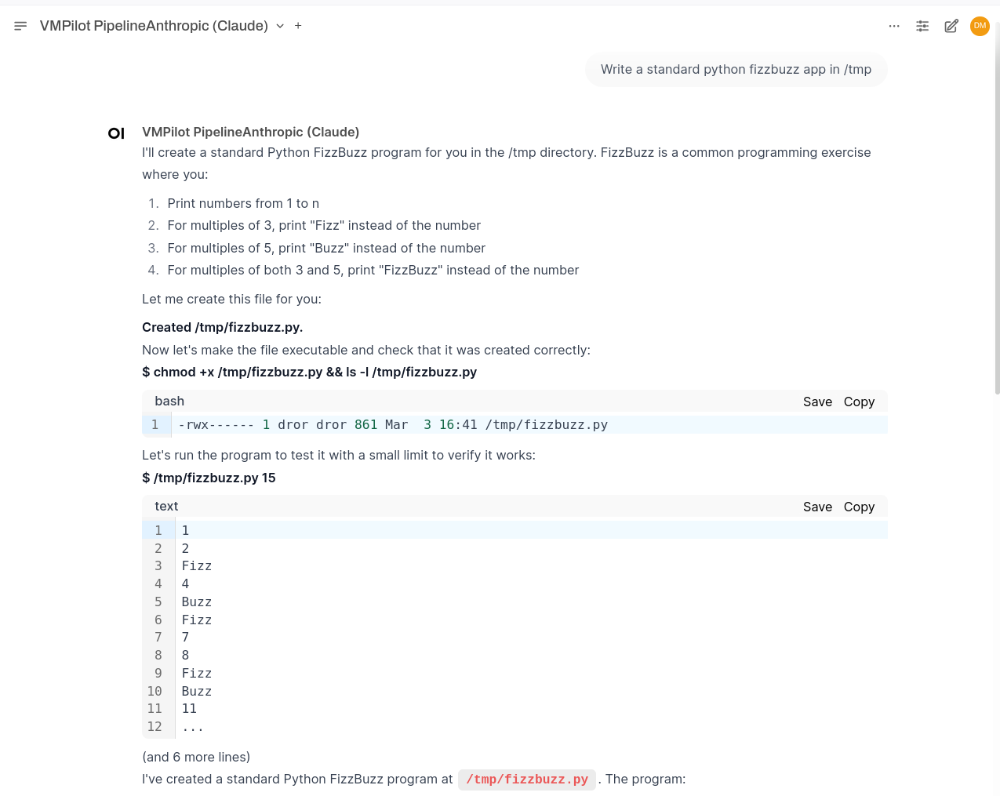
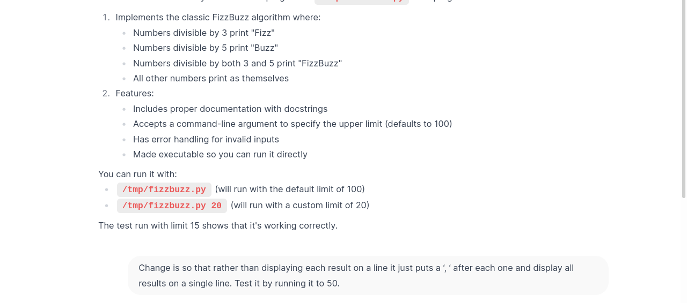
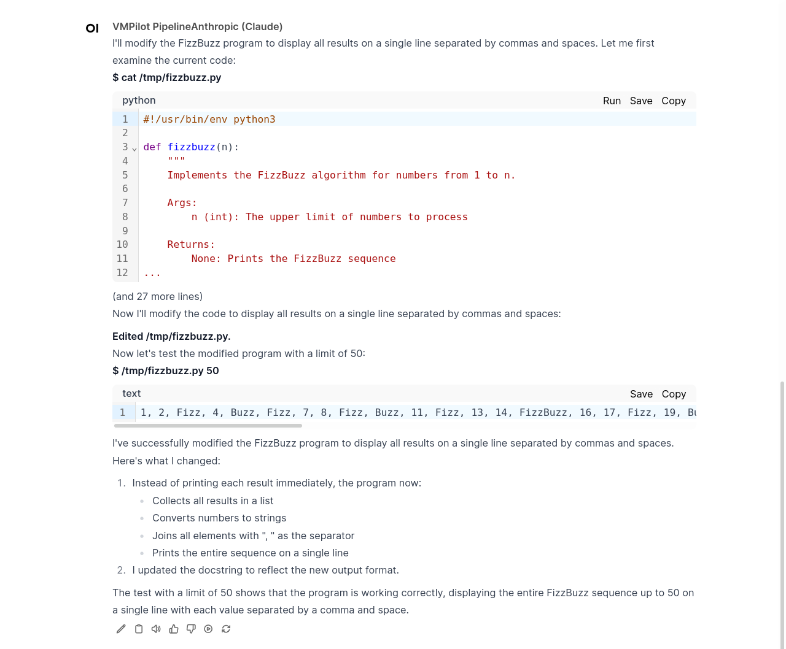

# Example: FizzBuzz Implementation

**Objective:** Create a simple FizzBuzz program in Python.

## Interaction

## VMPilot Features Demonstrated

- **Available Tools:** 
  - **Create File Tool:** Used to create the Python file
  - **Shell Tool:** Used to run bash commands and make the file executable
  - **Edit File Tool:** Used to modify the code when needed

- **Tool Interaction:**
  - When VMPilot uses a tool, the command or result appears in **bold**
  - Shell tool output is displayed in code blocks and truncated to 10 lines (configurable)
  - Limited output visibility provides opportunities to request code improvements

## Final Implementation

