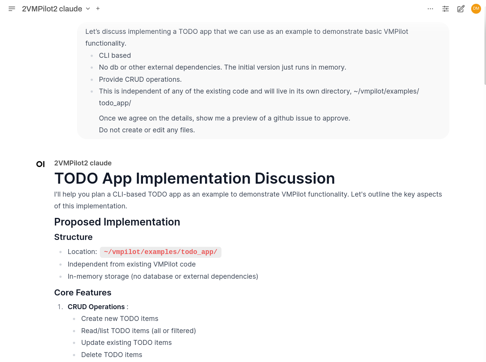
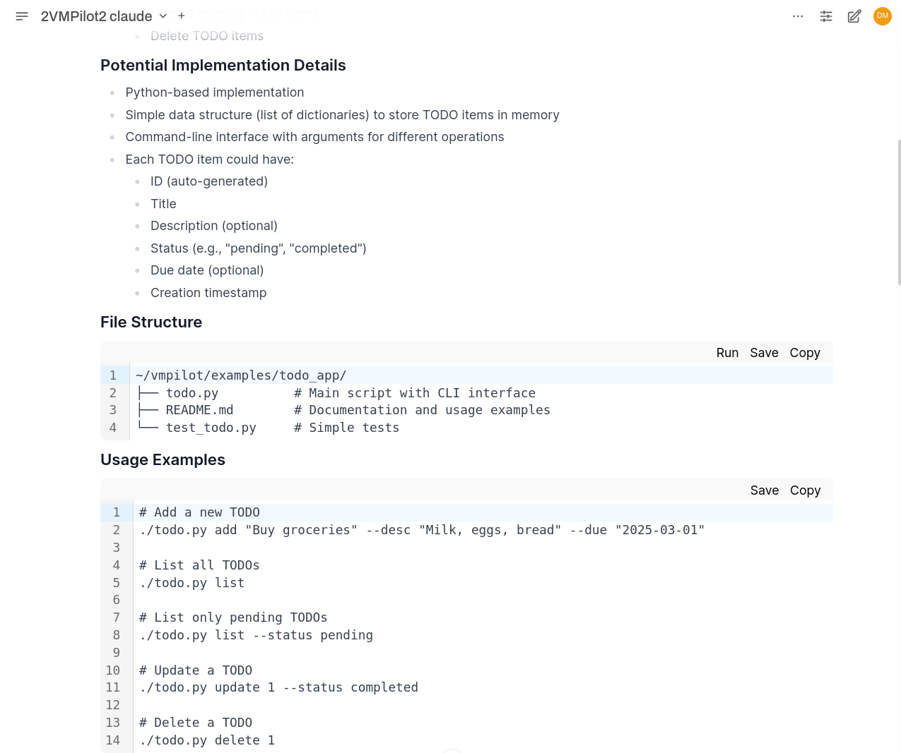
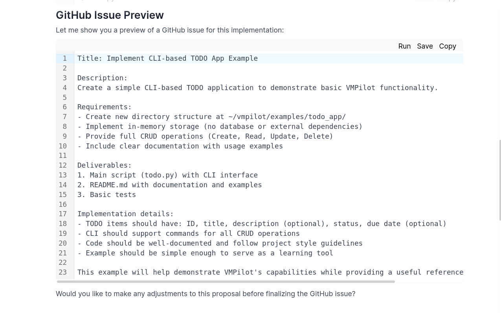
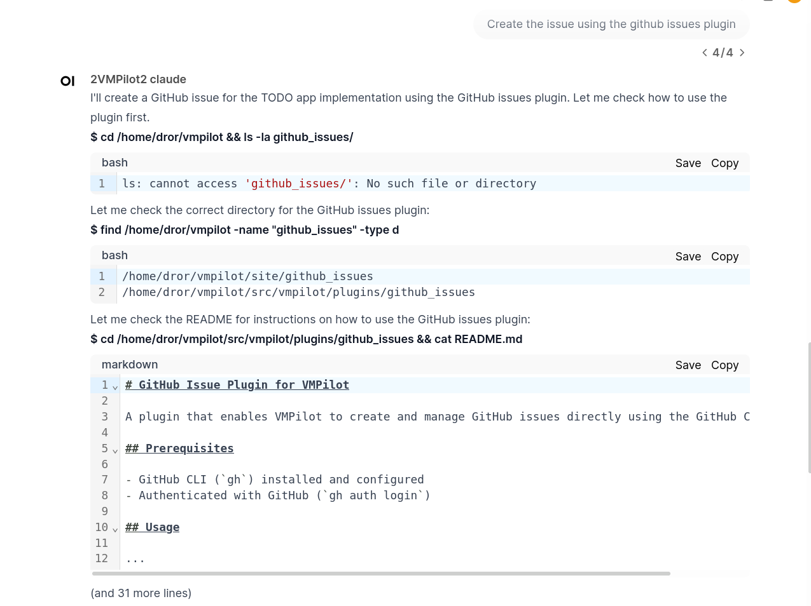
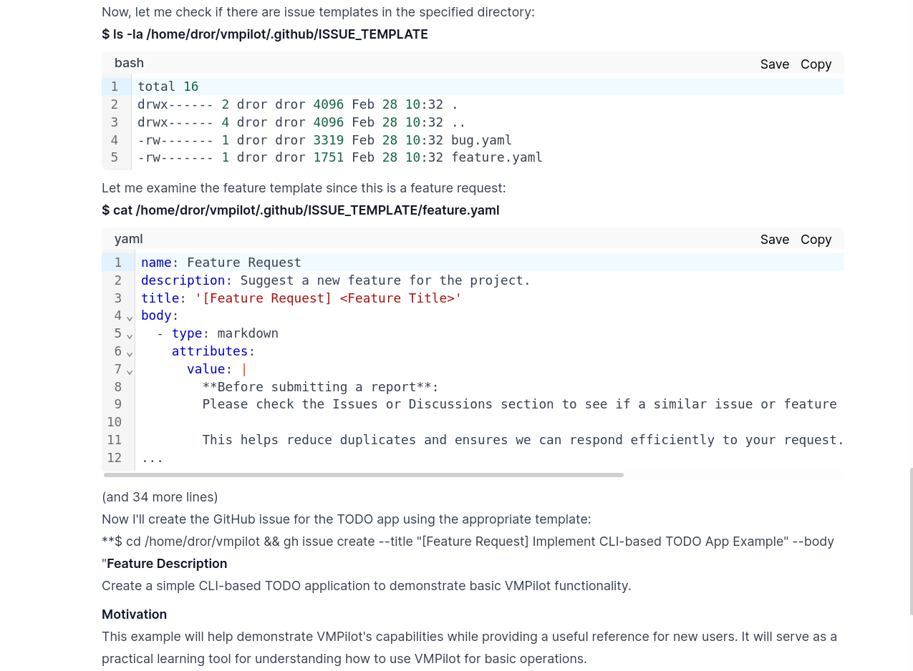
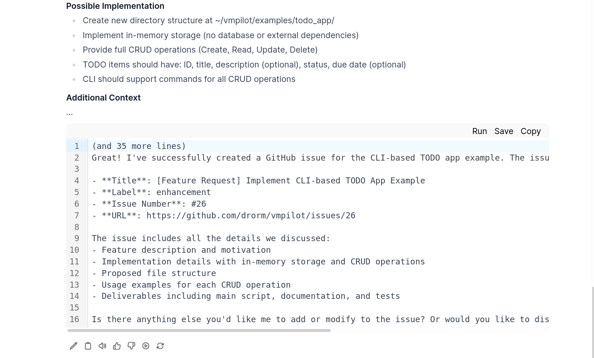

# Example: Create GitHub Issue

**Objective:** Use VMPilot to create a new GitHub issue.

## Workflow

### Step 1: Initial Request and Planning

- We begin by telling VMPilot that we want to create a GitHub issue
- Note that we specifically instruct it not to create files or the issue itself initially
- This is because VMPilot is designed to take action, and we first want to discuss and plan

### Step 2: Issue Creation Process

- After sufficient planning and back-and-forth to ensure all details are correct, we instruct VMPilot to create the issue
- The process involves several steps:
  1. VMPilot examines the issue plugin to understand how to create an issue
  2. It checks the feature template to identify required fields
  3. It runs the appropriate GitHub CLI command to create the issue
  4. Finally, it reports back on the operation's success

## Key Points

- VMPilot can interact with GitHub's API through the GitHub CLI
- The collaborative planning process ensures the issue meets requirements before creation
- The final result can be verified on GitHub: [Issue #26](https://github.com/drorm/vmpilot/issues/26)
- This example demonstrates VMPilot's ability to integrate with external tools and services
