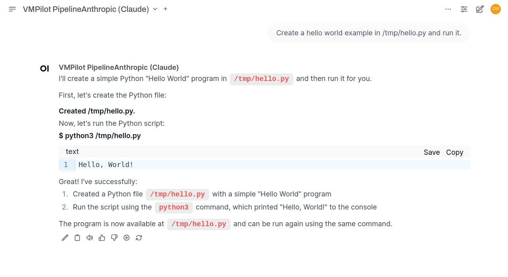

# Example: Hello World

**Objective:** Create and run a Python script that displays the current date and time.

## Interaction

## Notes

If you've used ChatGPT or Claude, this interface should be familiar:

- On the top left, you can select your preferred model
- The standard chat interface displays your request and VMPilot's response
- In the response, you can clearly see the actions taken by VMPilot:
    - **Created /tmp/hello.py** - VMPilot creates the Python file
    - Running a bash command: **$ python3 /tmp/hello.py** - VMPilot executes the script
    - The output of the command is displayed in a formatted code block

This simple example demonstrates how VMPilot can create files and execute commands based on natural language instructions.

