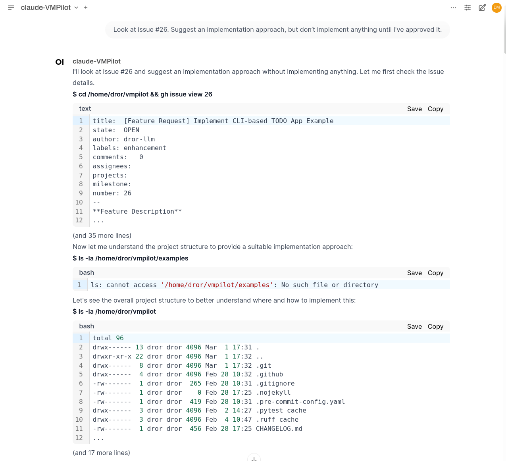
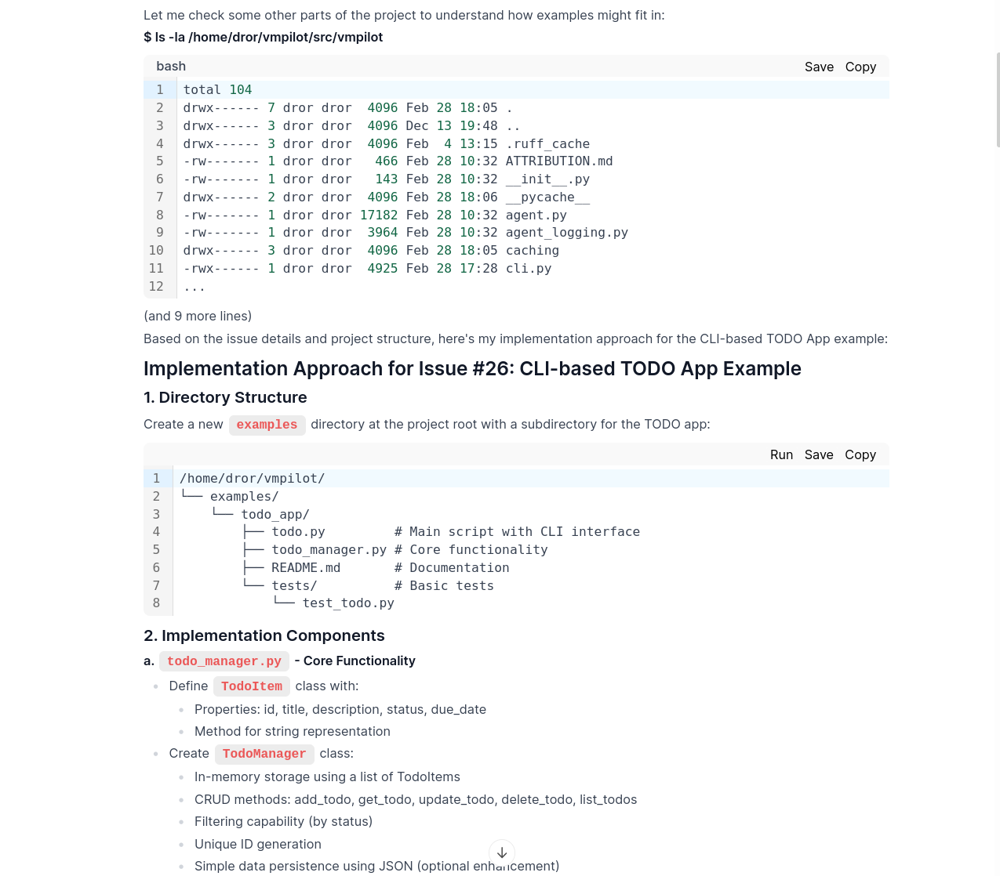
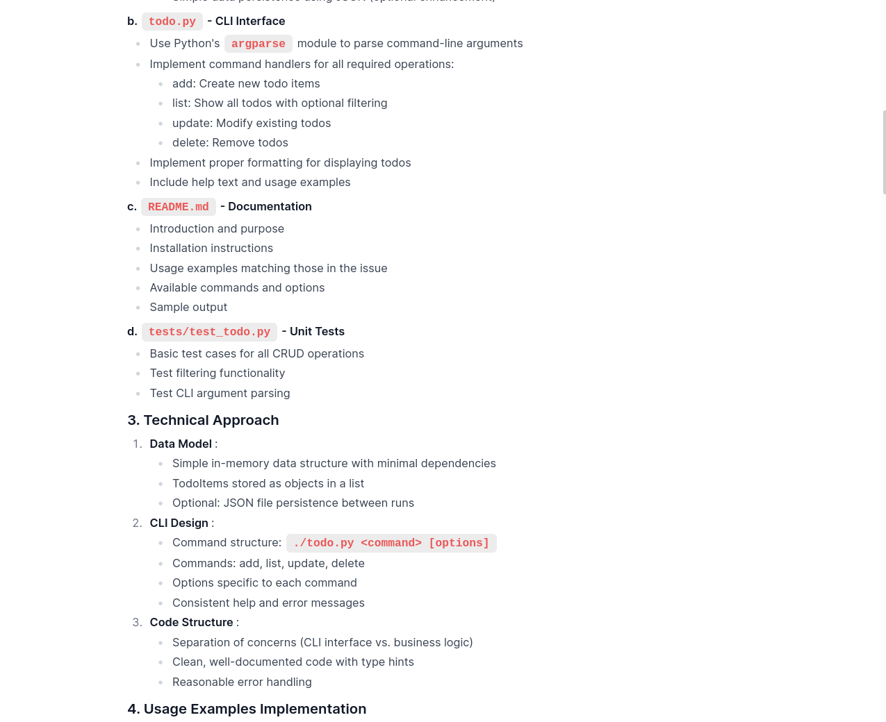
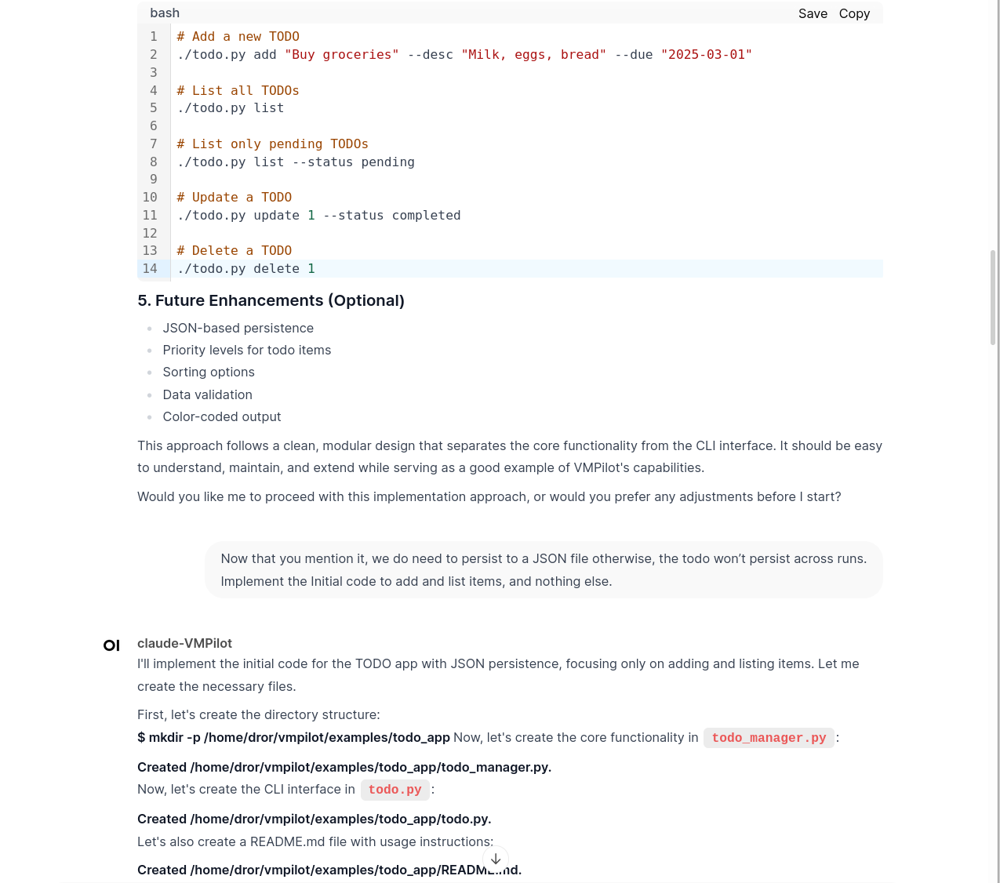
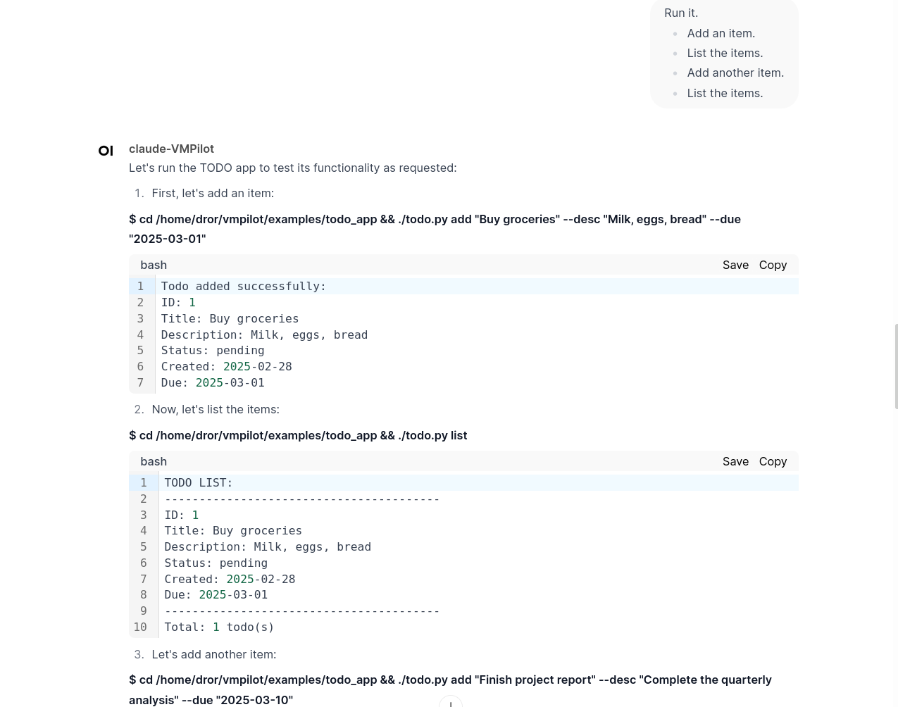
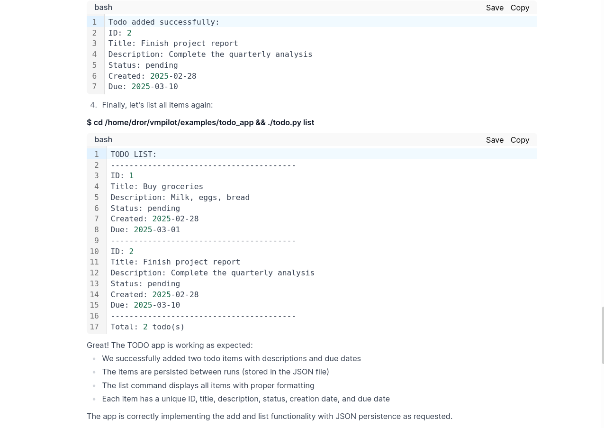
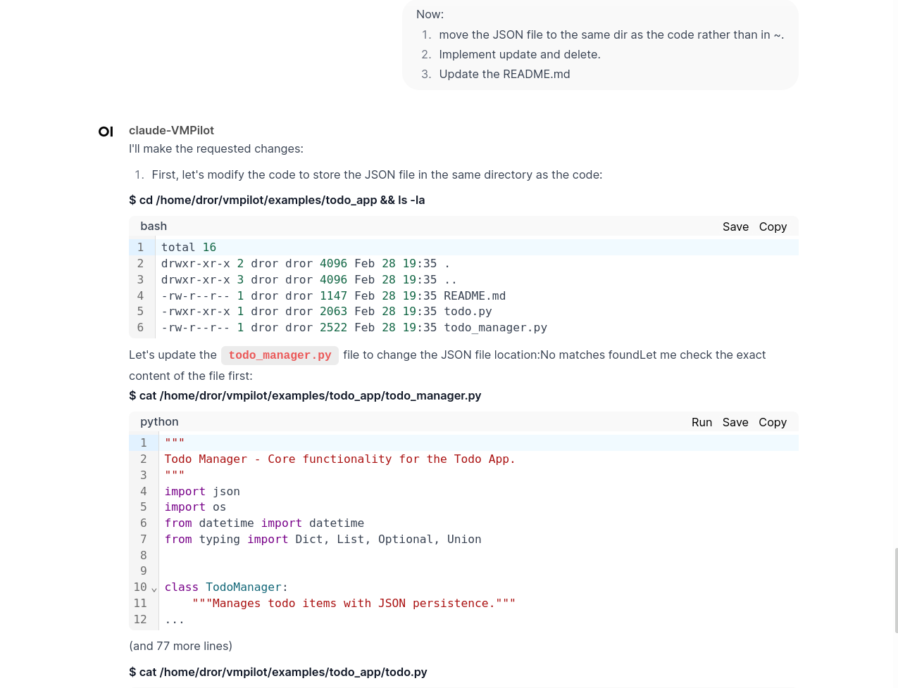
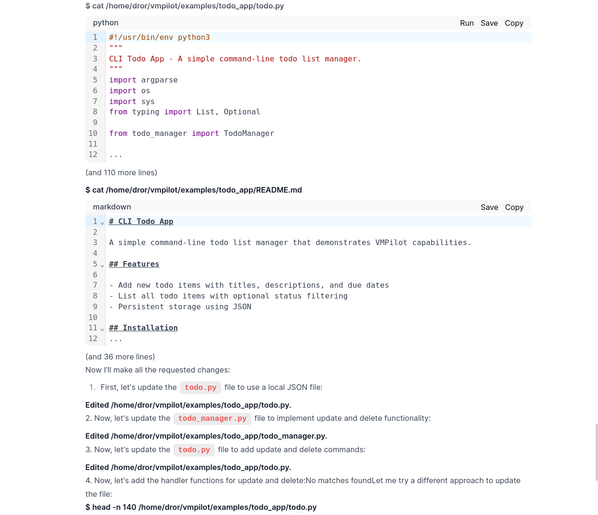

# Example: Todo List Application (Part 1)

**Objective:** Initial implementation of Issue #26: Create a Python todo list application

## Context

- In the previous example, we created [GitHub Issue #26](https://github.com/drorm/vmpilot/issues/26): Create a Python todo app
- We can now refer to this issue directly in our conversation with VMPilot
- Note: We initially ask VMPilot to discuss the issue before creating any files, to establish a clear plan

## Initial Planning

- It started above by looking at the issue and some files, and suggests a comprehensive plan to implement the issue.
- The plan looks good overall, but needs refining to save the data to a JSON file. 
- The LLM starts to implement the plan.

- And I ask it to run the app to test it.

- The testing looks good, but I noticed that the JSON file is in the root of the project, and I wanted it in the same directory as the app. So I ask the LLM to fix that and review the README.

