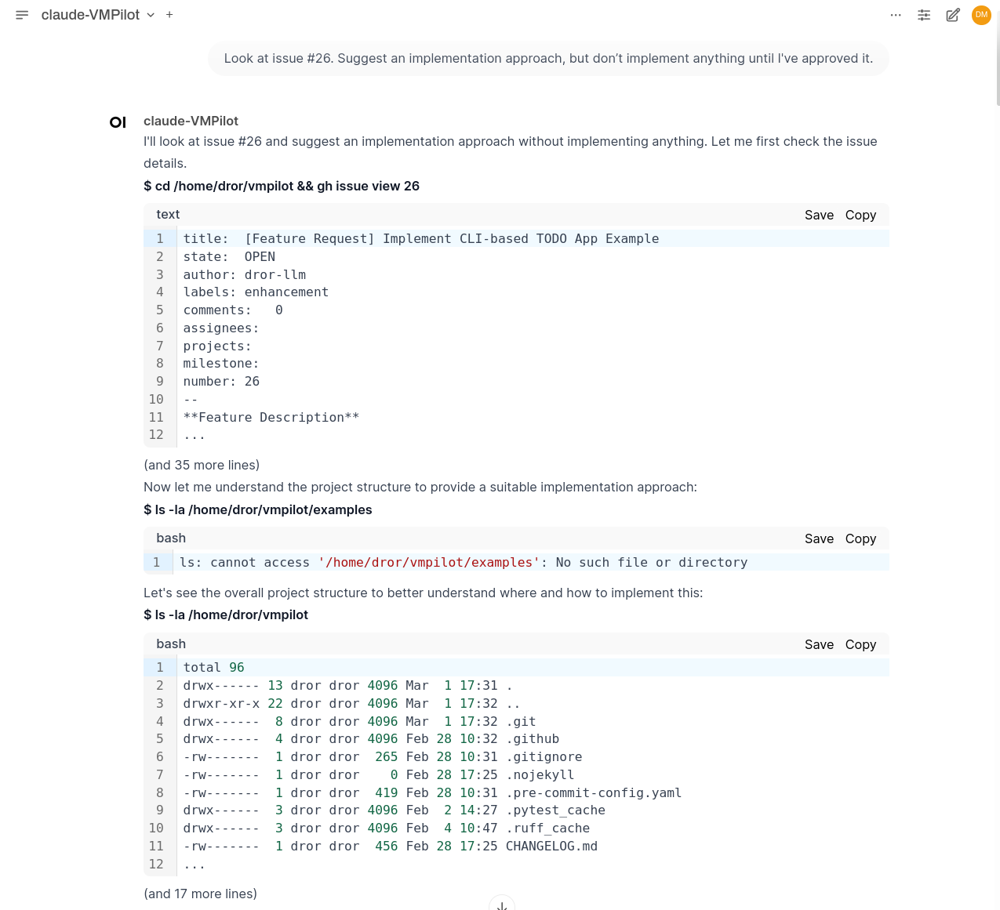
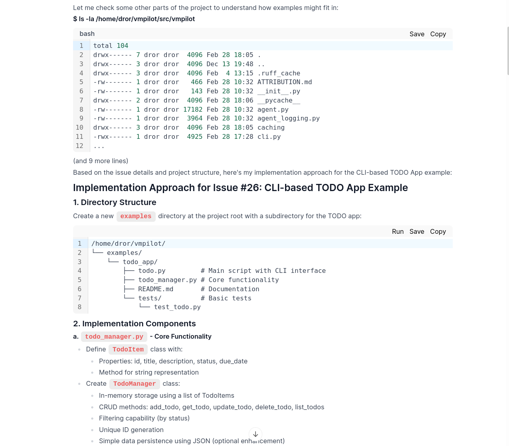
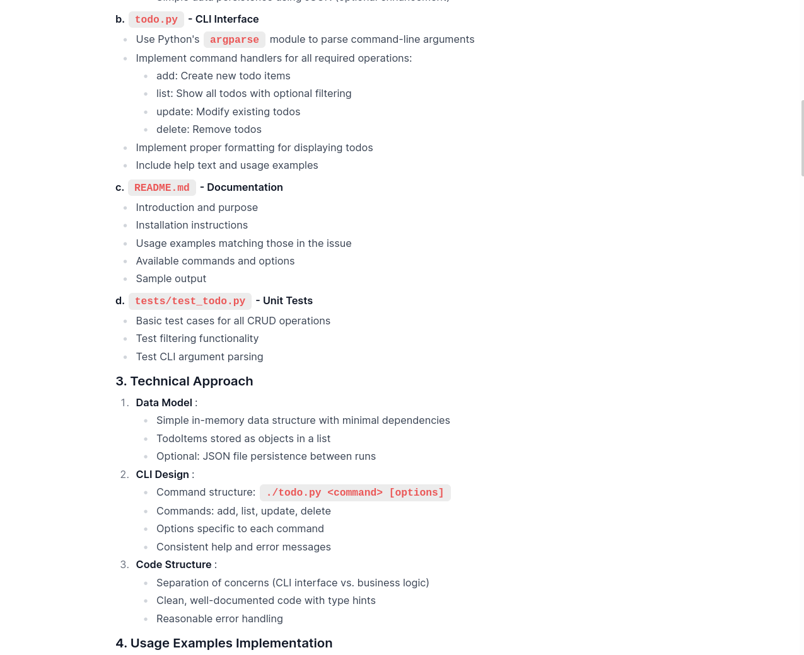
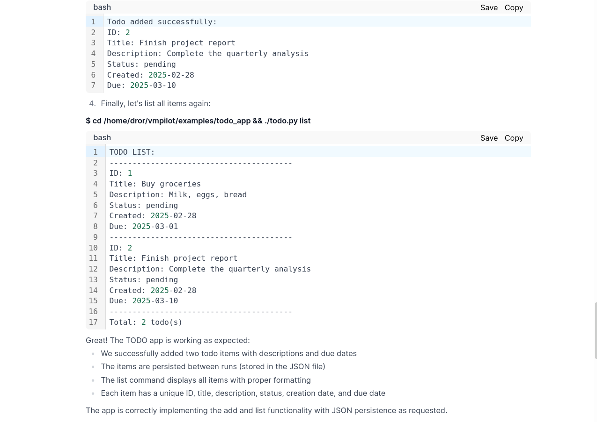
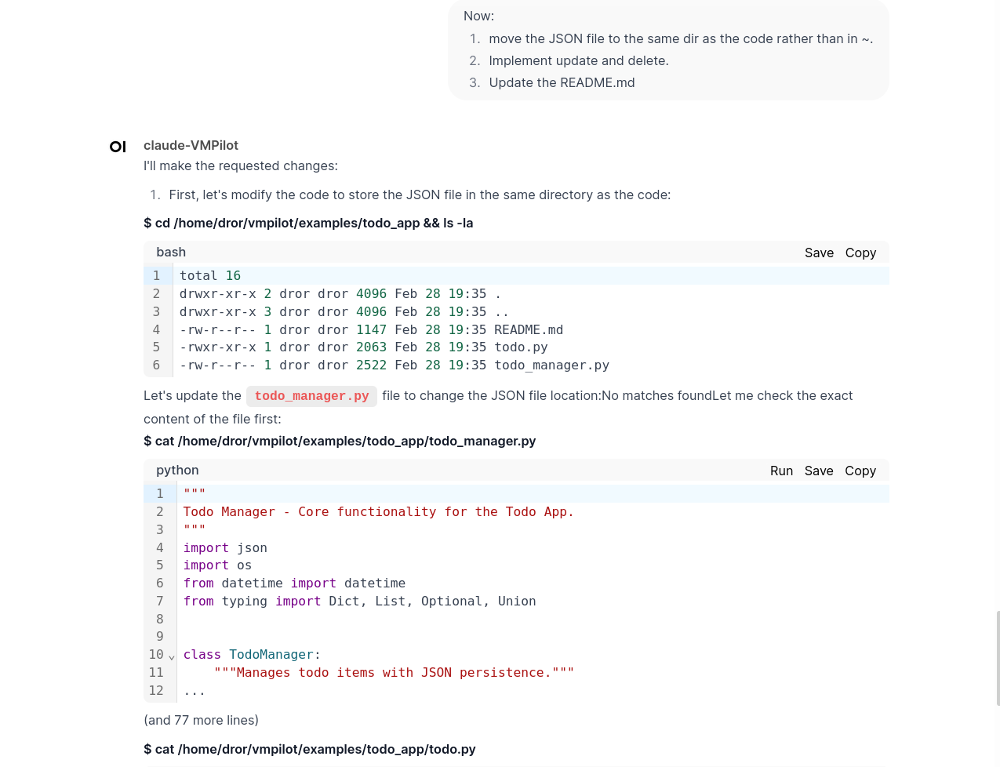

# Example: Create GitHub Issue

**Objective:** Finish implementation of issue 26: Create a python todo list.

## Notes

- In the previous example, we created the TODO app based on [github issue 26](https://github.com/drorm/vmpilot/issues/26): Create a python todo app.
- Here, we're finishing the app. Have the LLM check that everything works correctly, and then update the README. 
- We start with "look at issue #26". This gives the LLM context on what we're working on.
- Notice that we're not diving too much into details, because the Github issue should mostly cover that.

- Until now the LLM has been gathering information about the task. It looks at the github issue and various files. Now it starts to act.
- It tests the CRUD opeations: Create, Read, Update, Delete.

- Notice that we're getting the message: *Sorry, need more steps to process this request. I've done 25 steps in a row. Let me know if you'd like me to continue*. This is a safety mechanism to make sure the LLM is not stuck in a loop. The number is configurable. Simply type "continue" and the LLM will go on as in this example.

- And that's it. We have a working todo app with CRUD operations and a README file that describes how to use it.
- We skipped some steps/screenshots to keep the example short. 
